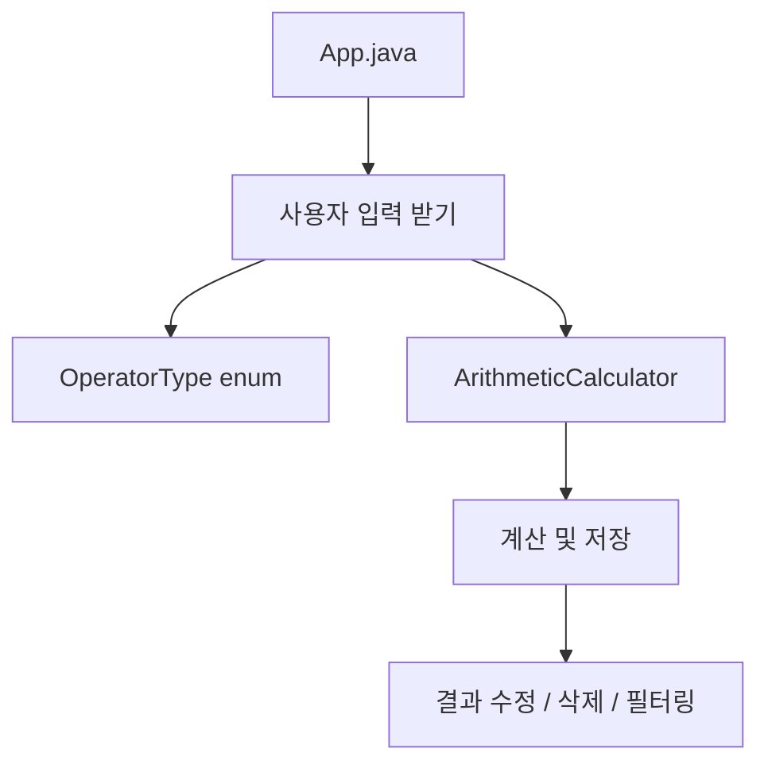

# 📘 Calculator Project

Java 기초 문법 및 객체지향 개념 학습을 위한 **계산기 프로젝트**입니다.  
단계별(`Lv1 → Lv2 → Lv3`)로 점진적으로 기능을 확장하며 **예외 처리**, **클래스 분리**, **컬렉션**, **제네릭**, **enum**, **스트림** 등을 학습합니다.

---

## 🪜 Level Overview

| Level | 주요 기능 | 학습 요소 |
|-------|-----------|-----------|
| Lv1   | 기본 사칙연산 및 입력 | try-catch, 반복문, Scanner |
| Lv2   | 클래스 분리, 캡슐화, 컬렉션| 클래스, 컬렉션, 메서드 분리, List, getter/setter |
| Lv3   | 제네릭, enum, Stream | 제네릭, enum, 함수형 프로그래밍 |

---

## 🧩 Lv1: 기본 계산기

- 사용자에게 입력받아 사칙연산 수행
- `exit` 입력 전까지 반복 실행
- 음수, 문자 등의 잘못된 입력에 대한 예외 처리

```bash
▶▶ lv1.App 실행 예시

첫번째 연산자(양의 정수)를 입력하세요: 10
두번째 연산자(양의 정수)를 입력하세요: 2
연산자 입력 (+, -, x, /): /
결과: 5
```

---

## 🔐 Lv2: 캡슐화 및 클래스 분리

- `Calculator` 클래스 분리, 연산 로직 이동
- 연산 결과를 리스트로 저장 및 관리
- 결과 조회, 수정, 삭제 기능 추가
- 메서드를 통한 간접 접근으로 캡슐화

```java
calculator.calculate(3, 2, '+');
calculator.getResult();
calculator.setResult(0, 5);
calculator.removeResult();
```

---

## 🔄 Lv3: 제네릭, Enum, Stream 적용

- `ArithmeticCalculator<T extends Number>`: 다양한 타입 지원
- `OperatorType` enum: 연산자 타입 안전성 확보
- `Stream API`로 조건에 맞는 연산 결과 필터링
- `switch expression`, `yield`, `람다` 활용

```java
OperatorType op = OperatorType.fromChar('+');
calc.calculate(10.5, 3.2, op);
calc.getResultsAbove(5.0);
```

```text
▶▶ lv3.App 실행 예시

첫 번째 숫자 입력: 12.5
두 번째 입력: 2.5
연산자 입력 (+, -, x, /): x
결과: 31.25
```

---

## 🧪 기능 흐름도 (Lv3 기준)



---

## 🧠 회고

- **Lv1**: 예외처리를 하며 try-catch 익숙해짐
- **Lv2**: 클래스를 분리하고 메서드 중심으로 관리하는 객체지향 구조를 학습함
- **Lv3**: 제네릭과 스트림, 함수형 프로그래밍에 대해 실습을 통해 감을 잡을 수 있었음

---

## 🖼 예시 스크린샷

> 아래는 Lv3 실행 결과 예시입니다:


---

## 🗂 디렉토리 구조

```
calculator-project
├── lv1
│   └── App.java
├── lv2
│   ├── App.java
│   └── Calculator.java
└── lv3
    ├── App.java
    ├── ArithmeticCalculator.java
    └── OperatorType.java

```

---

## 📌 학습 키워드 요약

- Java 기본 문법, 반복문, 예외처리
- 클래스, 생성자, 접근 제어자, 캡슐화
- 제네릭(Generic), enum, 스트림(Stream), 람다

---

## 🔗 GitHub Repository

[🔗 calculator-project](https://github.com/ZeroColaa/calculator-project)

---


